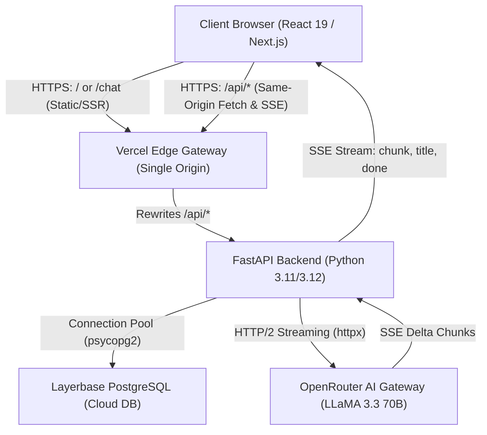
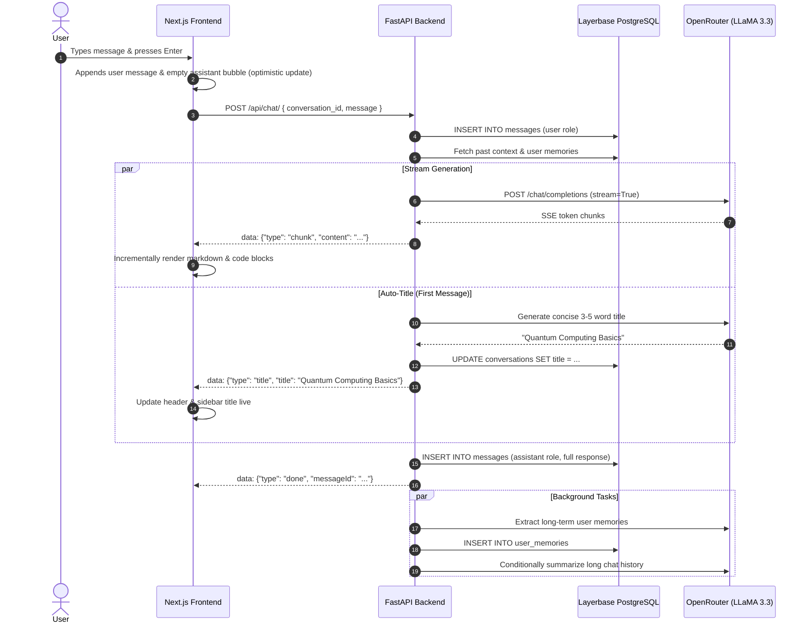

# 📘 Comprehensive System Documentation: Production AI Chatbot

---

## 1. What It Is

The **AI Chatbot** is a production-grade, full-stack conversational intelligence web application modeled after modern AI platforms like ChatGPT and Claude. It combines a sleek, dark-mode glassmorphic user interface with a high-performance, asynchronous Python backend, cloud-native PostgreSQL persistence, and real-time streaming large language models (LLMs).

### Core Capabilities

- **⚡ Real-Time Token Streaming**: Low-latency, token-by-token streaming using Server-Sent Events (SSE). Chunks stream into the UI within ~1 second of prompt submission.
- **💬 Multi-Conversation Workspace**: Create, switch, search, rename, and delete conversations with optimistic client state updates and persistent database synchronization.
- **✨ Automated AI Chat Titling**: Concurrently synthesizes a 3–5 word descriptive title based on the user's initial prompt and broadcasts it via SSE to update both the conversation header and sidebar in real time.
- **🧠 Cross-Conversation Long-Term Memory**: Automatically identifies personal facts, tech stacks, professions, and preferences from conversation turns. Categorizes and scores memories, storing them across chats and injecting them into future conversation prompts for personalized assistance. Includes a dedicated interactive Memory Manager modal.
- **🔗 Shareable Chat Links with Public Summarizer**: Allows users to generate public, read-only shareable links. Unauthenticated visitors can view the full discussion and click an AI Summarizer button to generate structured key takeaways.
- **👍 Feedback Loop & Developer Ergonomics**: Like/dislike message ratings, copy-to-clipboard actions for full messages and isolated code blocks with syntax highlighting.
- **🔐 Secure JWT Authentication**: End-to-end user registration and authentication powered by bcrypt password hashing and JSON Web Tokens (JWT).

---

## 2. System Architecture & How It Works

### High-Level Architecture Diagram



---

### Step-by-Step Lifecycles

#### A. Authentication Lifecycle
1. **Registration / Login**: The user enters their email and password in the Next.js UI (`/signup` or `/login`).
2. **Payload**: The client sends a `POST /api/auth/register` or `POST /api/auth/login` request.
3. **Password Security**: The Python backend uses `bcrypt.hashpw` with salt rounds for registration and `bcrypt.checkpw` for login verification.
4. **JWT Issuance**: Upon successful authentication, the backend signs a JWT token using `jose` containing the user ID, email, and expiration timestamp (default: 7 days).
5. **Client Persistence**: The client stores the JWT in `localStorage` and injects it as an `Authorization: Bearer <token>` header on all subsequent API requests.

#### B. Chat Interaction & Real-Time Streaming Lifecycle


#### C. Long-Term Memory Lifecycle
1. **Extraction**: After an assistant message finishes streaming, a background asynchronous task (`_background_tasks`) sends the exchange to the AI with extraction criteria.
2. **Filtering**: The system discards temporary details, secrets, passwords, or greetings, keeping only persistent preferences, skills, and goals.
3. **Categorization & Scoring**:
   - `profession` (Importance: 9)
   - `preference` (Importance: 7)
   - `learning` (Importance: 6)
   - `technical` (Importance: 5)
   - `general` (Importance: 5)
4. **Injection**: When the user opens any future chat, `get_relevant_memories_text()` queries the top memories from Layerbase and injects them into the system prompt:
   ```text
   You are a helpful, knowledgeable AI assistant.
   What you know about this user:
   - User works primarily with Python and Next.js
   - User prefers concise code with TypeScript
   ```

#### D. Public Sharing & AI Summarization Lifecycle
1. The user clicks **Share** inside the active conversation.
2. The client sends `PATCH /api/conversations/:id` with `{ is_shared: true }`.
3. The server generates a collision-resistant `share_token` (`secrets.token_urlsafe(24)`).
4. The shareable link (`https://.../share/<token>`) provides read-only access without exposing user IDs or internal credentials.
5. Visitors can click **Summarize this conversation**, which triggers `POST /api/share/<token>/summarize`. The backend formats the discussion into structured categories: **Main Topic**, **Key Points**, **Decisions**, and **Open Questions**.

---

## 3. Tech Stack & Justification: Why This Stack?

| Layer | Selected Technology | Why This Specific Choice? |
|---|---|---|
| **Frontend Framework** | **Next.js 16 (App Router + Turbopack)** | Combines fast initial page loads with smooth client-side React 19 interactivity. Turbopack provides sub-second compilation. Native dynamic routing (`/share/[token]`) allows clean, SEO-friendly shareable links. |
| **Styling & Design** | **Tailwind CSS 4 + Lucide React** | Allows fine-grained control over colors, glassmorphism (`backdrop-blur`), and custom scrollbars without CSS bloat. Lucide React provides modern, lightweight SVG icons. |
| **Backend Language & Framework** | **Python 3.11/3.12 + FastAPI** | Python is the undisputed industry standard for AI applications. FastAPI provides asynchronous ASGI event loops critical for streaming dozens of concurrent SSE connections without thread exhaustion. Native Pydantic validation ensures strict type safety. |
| **Database Engine** | **Layerbase (Managed PostgreSQL)** | Cloud-native PostgreSQL with managed connection pooling (`pooler`). Relational integrity guarantees cascading deletes (deleting a chat automatically removes all messages, feedback, and memories). Includes `pgcrypto` for UUIDv4 generation and ACID compliance. |
| **AI Inference Gateway** | **OpenRouter (`meta-llama/llama-3.3-70b-instruct`)** | OpenRouter provides a unified API across top models without vendor lock-in. LLaMA 3.3 70B Instruct provides GPT-4-class reasoning with near-instant Time-To-First-Token (~1.2s), avoiding the 30-second buffering delays found in heavy reasoning models. |
| **Cloud Deployment** | **Vercel Services** | Enables a unified deployment where Next.js and FastAPI run under the same domain. Eliminates CORS configuration headaches and browser Mixed Content blocks (`https` frontend calling `http` backend). |

---

## 4. Database Schema Deep Dive

The database runs on PostgreSQL and is initialized automatically on startup via `init_db()` in [`backend/app/database.py`](file:///c:/Users/chira/OneDrive/Desktop/my-agent/chatbot/backend/app/database.py).

```sql
-- 1. Users Table
CREATE TABLE users (
    id UUID PRIMARY KEY DEFAULT gen_random_uuid(),
    email VARCHAR(255) UNIQUE NOT NULL,
    name VARCHAR(255) NOT NULL,
    password_hash VARCHAR(255) NOT NULL,
    created_at TIMESTAMPTZ DEFAULT NOW(),
    updated_at TIMESTAMPTZ DEFAULT NOW()
);

-- 2. Conversations Table
CREATE TABLE conversations (
    id UUID PRIMARY KEY DEFAULT gen_random_uuid(),
    user_id UUID NOT NULL REFERENCES users(id) ON DELETE CASCADE,
    title VARCHAR(500) NOT NULL DEFAULT 'New Chat',
    summary TEXT,
    is_shared BOOLEAN DEFAULT FALSE,
    share_token VARCHAR(255) UNIQUE,
    created_at TIMESTAMPTZ DEFAULT NOW(),
    updated_at TIMESTAMPTZ DEFAULT NOW()
);

-- 3. Messages Table
CREATE TABLE messages (
    id UUID PRIMARY KEY DEFAULT gen_random_uuid(),
    conversation_id UUID NOT NULL REFERENCES conversations(id) ON DELETE CASCADE,
    role VARCHAR(20) NOT NULL CHECK (role IN ('user', 'assistant', 'system')),
    content TEXT NOT NULL,
    created_at TIMESTAMPTZ DEFAULT NOW()
);

-- 4. Message Feedback Table
CREATE TABLE message_feedback (
    id UUID PRIMARY KEY DEFAULT gen_random_uuid(),
    message_id UUID NOT NULL REFERENCES messages(id) ON DELETE CASCADE,
    user_id UUID NOT NULL REFERENCES users(id) ON DELETE CASCADE,
    feedback VARCHAR(10) NOT NULL CHECK (feedback IN ('like', 'dislike')),
    created_at TIMESTAMPTZ DEFAULT NOW(),
    UNIQUE(message_id, user_id)
);

-- 5. User Memories Table
CREATE TABLE user_memories (
    id UUID PRIMARY KEY DEFAULT gen_random_uuid(),
    user_id UUID NOT NULL REFERENCES users(id) ON DELETE CASCADE,
    memory TEXT NOT NULL,
    category VARCHAR(100) DEFAULT 'general',
    importance INTEGER DEFAULT 5 CHECK (importance BETWEEN 1 AND 10),
    created_at TIMESTAMPTZ DEFAULT NOW(),
    updated_at TIMESTAMPTZ DEFAULT NOW()
);

-- Optimized Query Indexes
CREATE INDEX idx_conversations_user_id ON conversations(user_id);
CREATE INDEX idx_conversations_updated_at ON conversations(updated_at DESC);
CREATE INDEX idx_messages_conversation_id ON messages(conversation_id);
CREATE INDEX idx_messages_created_at ON messages(created_at);
CREATE INDEX idx_user_memories_user_id ON user_memories(user_id);
CREATE INDEX idx_conversations_share_token ON conversations(share_token) WHERE share_token IS NOT NULL;
```

---

## 5. End-to-End Walkthrough Example

Here is a step-by-step example tracing an actual interaction from initial user registration through streaming chat and public sharing.

### Step 1: User Registration
- **Request**:
  ```http
  POST /api/auth/register HTTP/1.1
  Content-Type: application/json

  {
    "email": "alex@example.com",
    "name": "Alex Mercer",
    "password": "SecurePassword123!"
  }
  ```
- **Response** (`201 Created`):
  ```json
  {
    "token": "eyJhbGciOiJIUzI1NiIsInR5cCI6IkpXVCJ9...",
    "user": {
      "id": "e4a2d810-7b24-4f51-bfa6-8ef3c8d19a42",
      "email": "alex@example.com",
      "name": "Alex Mercer"
    }
  }
  ```

### Step 2: Create a Conversation
- **Request**:
  ```http
  POST /api/conversations/ HTTP/1.1
  Authorization: Bearer <token>
  Content-Type: application/json

  { "title": "New Chat" }
  ```
- **Response** (`201 Created`):
  ```json
  {
    "conversation": {
      "id": "c194b830-45f8-410a-bf41-7140bc84d123",
      "title": "New Chat",
      "is_shared": false,
      "message_count": 0
    }
  }
  ```

### Step 3: Send Prompt & Receive Live SSE Stream
- **Request**:
  ```http
  POST /api/chat/ HTTP/1.1
  Authorization: Bearer <token>
  Content-Type: application/json

  {
    "conversation_id": "c194b830-45f8-410a-bf41-7140bc84d123",
    "message": "I am a DevOps engineer building Docker pipelines in Python. What are 3 tips to optimize image build times?"
  }
  ```
- **Stream Output (`text/event-stream`)**:
  ```text
  data: {"type": "chunk", "content": "Here"}

  data: {"type": "chunk", "content": " are 3 tips to"}

  data: {"type": "chunk", "content": " optimize Docker build times in Python:\n\n1. **Use Multi-Stage Builds**"}

  data: {"type": "title", "title": "Docker Python Pipeline Optimization"}

  data: {"type": "chunk", "content": "\n2. **Leverage Layer Caching**..."}

  data: {"type": "done", "messageId": "msg_98a72b", "userMessageId": "msg_12f84c", "title": "Docker Python Pipeline Optimization"}
  ```
- **Observed Behavior**:
  1. The response appears token-by-token in under ~1.2 seconds.
  2. The sidebar and header title automatically change from `"New Chat"` to `"Docker Python Pipeline Optimization"`.
  3. A new long-term memory is extracted in the background: `"User is a DevOps engineer working with Docker and Python"` (`category: profession`, `importance: 9`).

### Step 4: Share Conversation
- **Request**:
  ```http
  PATCH /api/conversations/c194b830-45f8-410a-bf41-7140bc84d123 HTTP/1.1
  Authorization: Bearer <token>
  Content-Type: application/json

  { "is_shared": true }
  ```
- **Response** (`200 OK`):
  ```json
  {
    "conversation": {
      "id": "c194b830-45f8-410a-bf41-7140bc84d123",
      "title": "Docker Python Pipeline Optimization",
      "is_shared": true,
      "share_token": "k8XmP_91vNz4LoQ721aBcz0R"
    }
  }
  ```
- **Public URL**: `https://chatbot-three-psi-79.vercel.app/share/k8XmP_91vNz4LoQ721aBcz0R`

### Step 5: Public Visitor Summarizes Chat
- **Request**:
  ```http
  POST /api/share/k8XmP_91vNz4LoQ721aBcz0R/summarize HTTP/1.1
  ```
- **Response** (`200 OK`):
  ```json
  {
    "summary": "**Main Topic:** Optimizing Docker build times for Python applications.\n\n**Key Points:**\n• Implement multi-stage builds to produce minimal final images.\n• Order Dockerfile instructions to maximize layer cache hit rates.\n• Use `.dockerignore` to avoid copying unnecessary context.\n\n**Important Decisions/Conclusions:**\n• Pin dependency layers separately before copying source code.\n\n**Open Questions:**\n• None."
  }
  ```

---

## 6. Local Setup vs Cloud Deployment Cheat Sheet

```bash
# ── Local Development ──
# 1. Start FastAPI backend (Terminal 1)
cd backend
python -m pip install -r requirements.txt
python -m uvicorn app.main:app --host 127.0.0.1 --port 8000 --reload

# 2. Start Next.js frontend (Terminal 2)
npm install
npm run dev
# Open http://localhost:3000

# ── Cloud Deployment (Vercel) ──
# Deployed automatically via Vercel Services
vercel --prod
# Production App: https://chatbot-three-psi-79.vercel.app
```
